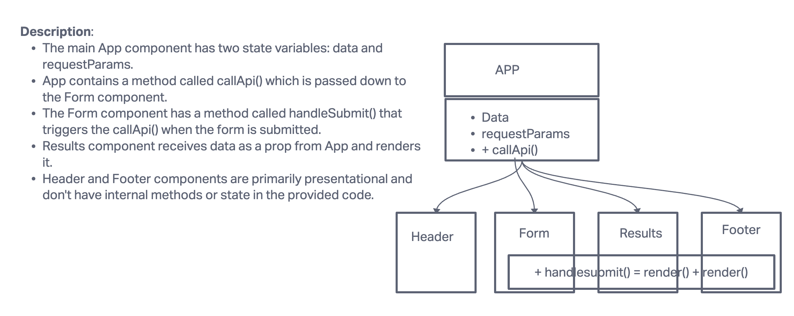

# RESTy

RESTy is a simple React-based API client that lets users interact with RESTful services.

## Development Phases

### Phase 1: Initial Setup

- Establish a basic React environment.
- Set up an initial application state.
- Facilitate primary rendering mechanisms.

### Phase 2: User Interaction & State Management

- Transition the application to functional components.
- Integrate the `useState()` hook for state management.
- Implement mechanisms to capture and manage user input.

## Components

1. **App**: The main container.
2. **Header**: Displays the application's title.
3. **Form**: Input for API URLs and HTTP method selection.
4. **Results**: Showcases the API response.
5. **Footer**: Displays footer information.

## Getting Started

1. Clone this repository:
2. Navigate to the project directory:
3. Install dependencies:
4. Run the application:
5. Start the application

[Deployed Netlify](https://adnan-resty.netlify.app/)
